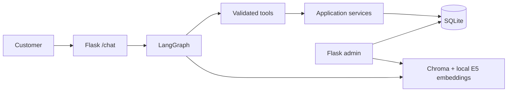
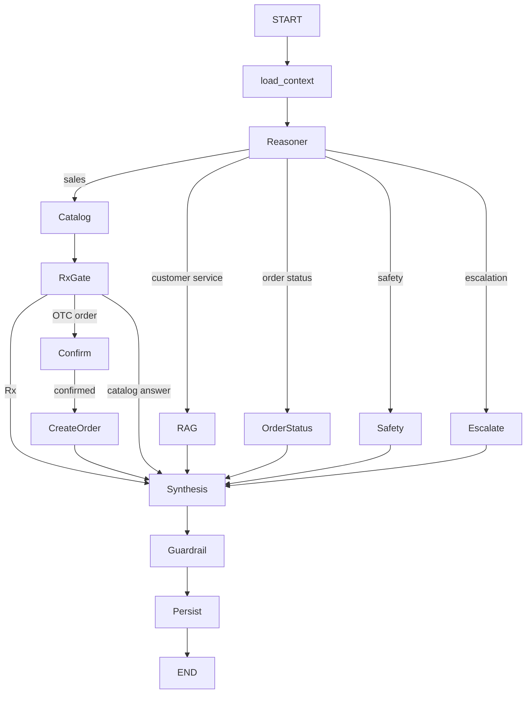
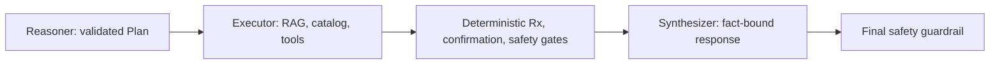
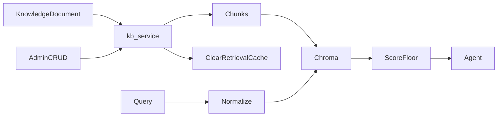
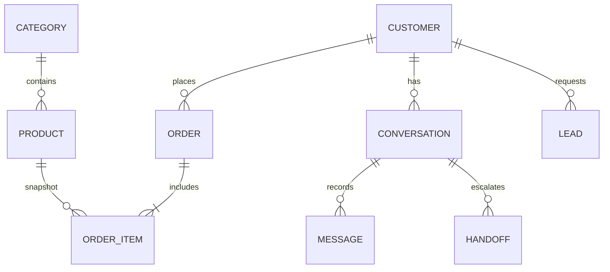
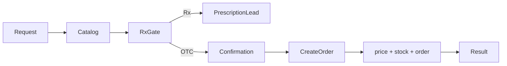

# Shifa Pharmacy AI Sales & Customer Service Agent

Shifa Pharmacy is a bilingual online-pharmacy demo for OTC and prescription medicine, supplements, baby care, personal care, and devices. It combines a Flask admin dashboard, SQLite business data, persistent Chroma policy retrieval, and a constrained LangGraph agent.

## What works

- Admin CRUD for categories, products, orders, customers, and knowledge documents.
- Persistent bilingual knowledge base with reindexing and status visibility.
- Customer chat at `/chat` and JSON endpoint `POST /api/chat`; transcripts are viewable under `/admin/conversations`.
- SQL-backed product search, availability, order status, prescription requests, pharmacist escalation, and real order creation.
- An order computes price and delivery from live SQL data and decrements stock in one transaction. Prescription products are rejected in data, service, and graph layers.
- English, Arabic, and Egyptian Arabic detection with deterministic safety, prescription, and confirmation messages.

## Architecture

The diagrams below are generated from their matching `.mmd` sources in `docs/diagrams/` with `node scripts/render_diagrams.mjs`.





### Reasoner → Executor → Synthesizer



### RAG and knowledge CRUD sync



### Database relationships



### Order execution



Policy and service content is retrieved from Chroma; current price, stock, customer data, and orders are always read from SQL. Chroma is a derived index from `KnowledgeDocument`, so it can be rebuilt safely. `intfloat/multilingual-e5-small` is local and avoids an embedding API key, but Arabic/Masri semantic matching is not perfect; English/Arabic text and aliases are deliberately stored together.

## Run locally

1. Create a virtual environment and install requirements:

   ```powershell
   py -3 -m venv .venv
   .\.venv\Scripts\Activate.ps1
   python -m pip install -r requirements.txt
   ```

2. Copy `.env.example` to `.env`. Set `SECRET_KEY`, `OPENROUTER_API_KEY`, and `LLM_MODEL`. The application still boots without an LLM key, but ordinary LLM-classified chat requests degrade safely; deterministic safety requests work.

3. Initialise local data:

   ```powershell
   flask --app app:create_app db upgrade
   python scripts/seed_db.py
   python scripts/reindex_kb.py
   flask --app app:create_app run
   ```

4. Open `http://127.0.0.1:5000/chat` or `http://127.0.0.1:5000/admin/`.

Run tests with `python -m pytest -q --disable-warnings`.

## Environment and limitations

`DATABASE_URL` configures SQLite (the SQLAlchemy 2.x models are portable to PostgreSQL). `OPENROUTER_API_KEY`, `LLM_MODEL`, and optional `LLM_FALLBACK_MODEL` configure structured classification. `CHROMA_PERSIST_DIRECTORY` points to the rebuildable vector store. Cache files are under `data/cache/` and ignored by Git.

The agent does not diagnose or give dosage advice. It creates a pharmacist handoff for medical questions. A prescription request is logged for Rx items and the order path remains blocked. It does not cache synthesizer output, live price, stock, or order data. SQLite is appropriate for the demo; a PostgreSQL deployment should use row locks for inventory contention. Messenger is intentionally deferred because it is the optional milestone.

